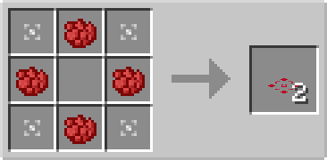
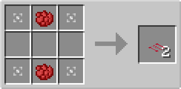

# Accelerator Plate

## Description

---

Accelerator Plates are special blocks that can be placed on top of solid blocks. They have no collision box, allowing entities to pass through them, but they affect entities that move over them.

### Accelerator Plate

The Accelerator Plate speeds up entities moving over it. It increases their movement speed up to a certain limit, making them move faster in whatever direction they're already traveling.

### Directional Accelerator Plate

The Directional Accelerator Plate accelerates entities in a specific direction based on the plate's facing. Entities moving over it will be pushed in the direction the plate is facing. Unlike the Accelerator Plate, it also affects motionless entities, allowing it to act as a conveyor, of sorts.

## Crafting

---

Accelerator Plate:

Directional Accelerator Plate:

