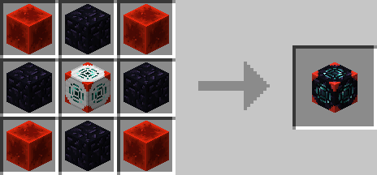
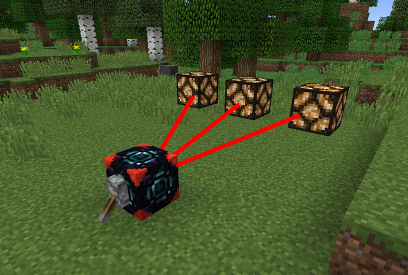

# Advanced Redstone Interface

## Description

---

Compared to the basic Redstone Interface the advanced one can be linked to a total of 9 blocks. Instead of the Redstone Tool you use [Position Filters](../items/position-filter) which you insert into the gui of the block.

## Crafting

---

## Screenshots

---

