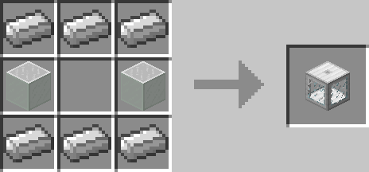

# Biome Radar

## Description

---

In Dungeon Chests around the world you will find Biome Crystals that “represent” a random biome, using the Biome Radar you can search for biomes in your world. After you place it down you have to put an antenna made out of Iron Bars on top of it (Screenshot 1). Without that antenna it won’t work. If you rightclick the Biome Radar with a Biome Crystal in your hand the Biome Crystal will be inserted into the radar, by right clicking it with an empty hand you can take it out again. With a Biome Crystal in the radar you have to apply a redstone signal to it with something like a lever to start the search. While searching colored smoke will emit from the antenna, once the biome is found a fifth line of smoke will appear in the middle of the antenna. You can now get a position filter of the position the biome was found at by right clicking the biome radar with a piece of paper.

## Crafting

---

## Screenshots

---

