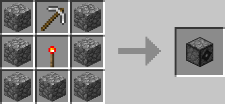
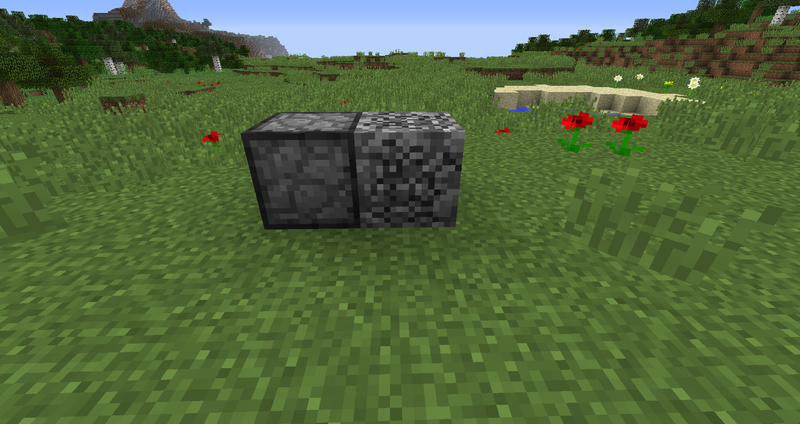

# Block Breaker

## Description

---

The Block Breaker is a block that breaks the block in front of it. It acts as if it was using a iron pickaxe, therefore it mines at the same speed an iron pickaxe does and can’t break blocks an iron pickaxe can’t break. If you place an inventory behind the block breaker all items dropped by broken blocks will go into that inventory instead of falling on the ground. Applying a redstone signal to it will disable it.

## Crafting

---

## Screenshots

---

