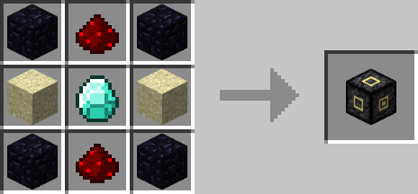

# Block Destabilizer

## Description

---

The Block Destabilizer will make blocks connected to its front fall down when powered by redstone. It can destabilize a total of 50 (Configurable) blocks at once though they all have to be connected to each other and of the same type. In its GUI you can toggle lazy mode, in lazy mode the block destabilizer will remember what blocks it dropped last time so it will run faster on consecutive runs. However it won’t be able to drop any blocks outside of the “shape” it dropped last time. Use lazy mode if you want a block destabilizer to keep dropping the same shape of blocks. You can reset the remembered shape with the arrow button. You can also enable Fuzzy Mode which will cause the Block Destabilizer to only care about the block type and not about the exact state (Oak Wood Planks vs Wood Planks).

## Crafting

---

## Videos

---

<video controls>
  <source src="https://lumien.net/rtwiki/images/screenshots/block-destabilizer.mp4" type="video/mp4">
</video>