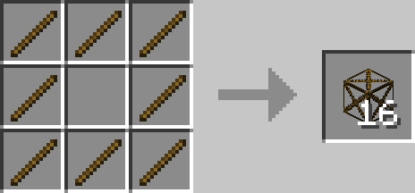
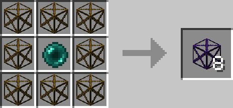

# Block of Sticks

## Description

---

Block of Sticks are temporary building blocks, they will break 10 seconds after you place without dropping anything. You can use them to get to high places without leaving behind ugly block pillar.
The Returning Block of Sticks don’t just break but return to the inventory of the closest player after the 10 seconds pass.

## Crafting

---

