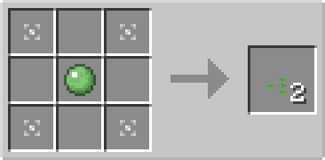

# Bouncy Plate

## Description

---

The Bouncy Plate is a special block that can be placed on top of solid blocks. It has no collision box, allowing entities to pass through it, but it affects entities that move over it.

The Bouncy Plate propels entities upward when they move over it. It launches entities into the air, making it useful for creating jumps or vertical transportation systems.

## Crafting

---

TODO

