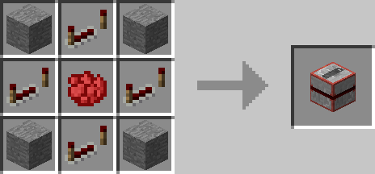
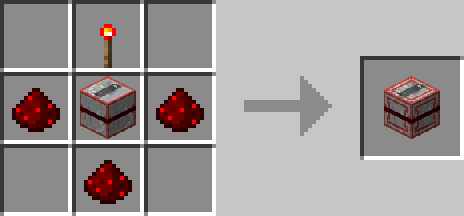
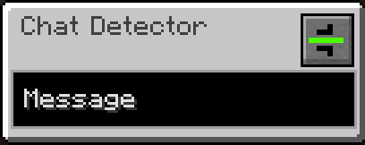
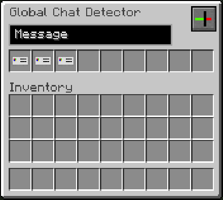

# Chat Detector

## Description

---

The Chat Detector is a Block that outputs a redstone signal when the player it was placed by enters something in the chat. If you open up its gui you can enter the message its supposed to detect and also change the mode its in.
By default the chat message its detecting will still be displayed in chat. However if you change the mode in the gui it will "consume" the message so it won't appear in chat.

The Global Chat Detector works similarly but isn't limited to the player that placed it, instead it will react to chat messages from any player. However for the "consuming" mode to work it will require an [ID Card](../items/id-card) of the player that typed the message.

## Crafting

---

## Screenshots

---

