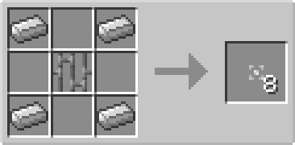
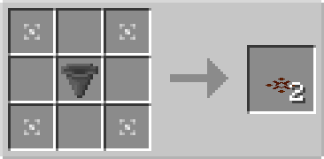

# Collection Plate

## Description

---

The Collection Plate is a flat plate that can be placed on top of solid blocks. It has no collision box, allowing entities to pass through it, but it affects item entities that move over it.

The Collection Plate automatically collects item entities that move over it into adjacent inventories.

## Crafting

---

