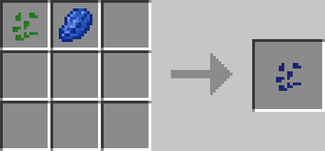

# Colored Grass

## Description

---

Dye Grass in any of the vanilla colors! Just pick up some grass with your silktouch shovel, put it in a crafting table to get grass seeds and then color the seeds. Right clicking with a grass seed on a piece of dirt will turn it into grass with the color of the seed.
Colored Grass spreads like normal grass but will not grow over normal grass.

## Crafting

---

