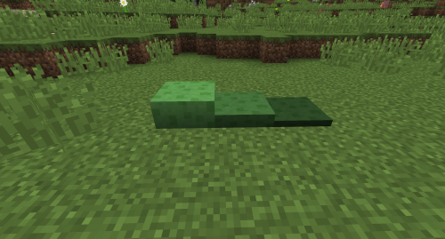

# Compressed Slime Block

## Description

---

You make compressed slime blocks by right clicking vanilla slime blocks with a shovel. Any entity that comes in contact with one gets bounced upwards. You can right click it 2 more times to compress it further, increasing its bounciness.

## Screenshots

---

