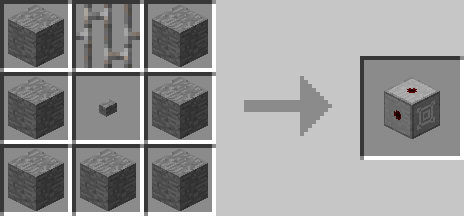

# Contact Button & Lever

## Description

---

Contact Buttons & Contact Levers act like normal buttons / levers except that they are full blocks and they don’t react to themselves but the block in front of them being right clicked. So if you place a block of stone in front of them and right click that stone they will react to that.

## Crafting

---

