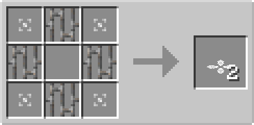

# Corrector Plate

## Description

---

The Corrector Plate is a flat plate that can be placed on top of solid blocks. It has no collision box, allowing entities to pass through it, but it affects entities that move over it.

The Corrector Plate straightens out the movement of entities. It aligns entities to move in a perfectly straight line, removing any sideways drift or deviation from their path.

## Crafting

---

