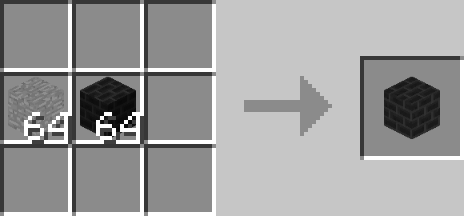

# Diaphanous Blocks

## Description

---

Diaphanous Blocks change their opacity depending on the distance to the player. By combining them with any block in a crafting table you can change their appeareance to any block that doesn’t have a tileentity. By default they don’t have a collision box and vanish when you get close to them. The inverted version you get by putting them in a crafting table on their own has a collision box and appears when you get close.

## Crafting

---

Crafting

Changing Appeareance

Inverting

## Screenshots

---

<video controls>
  <source src="https://lumien.net/rtwiki/images/screenshots/diaphanous-blocks.mp4" type="video/mp4">
</video>