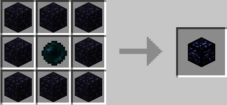
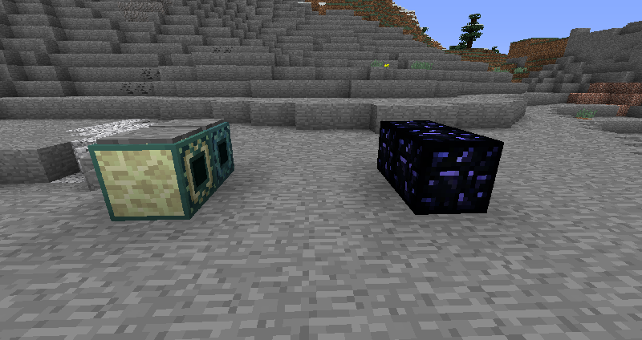

<!-- TODO: Verify teleportation speed and range mechanics -->
---
title: Ender Bridge
category: blocks
---

# Ender Bridge

## Description

---

Ender Bridges let you teleport across your entire world with no distance limit. All you need is a clear path of air blocks between the bridge and an Ender Anchor. The teleportation isn't instant though - the standard Ender Bridge takes about 5 seconds to travel 100 blocks, while the Prismarine Ender Bridge is much faster, covering the same distance in just half a second. Don't worry about unloaded chunks either - Ender Anchors automatically keep their chunk loaded so bridges can always find them.

To use a bridge, just power it with redstone. Once activated, it starts searching for the nearest Ender Anchor and will teleport anyone standing within 2 blocks of it. After teleporting, the bridge goes into cooldown and stays that way until you remove the redstone signal. This prevents accidental double-teleports and gives you control over when the bridge is active.

*Handy tip: The bridges ignore the block right in front of them, so you can place a pressure plate on top and still have the bridge face upward for easy activation.*

## Crafting

---

## Screenshots

---

