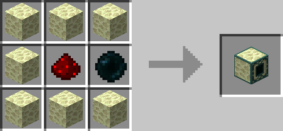
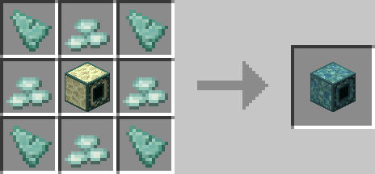

# Ender Bridge

## Description

---

The Ender Bridge theoretically allows you to teleport across your world with no distance limit. The only requirement is a line of air blocks between the ender bridge and the ender anchor. However the teleportation is not instant, the normal ender bridge takes 5 seconds to teleport you across 100 blocks (“Scans” 20 blocks per second). The Prismarine Ender Bridge is much faster and would only take half a second for the same distance (“Scans” 200 Blocks per second). Ender Bridges will only check loaded chunks for Ender Anchors, this however is not an issue as the Ender Anchors load the chunk they are in.

The Bridges start to “search” for an ender anchor once a redstone signal is applied to them, once they find one they will teleport every player in a 2 block radius around them to the ender anchor and then go into cooldown mode where they will stay till they no longer receive a redstone signal.

*The Bridges ignore the block immediately in front of them so you can place a pressure plate on top of them and still let them face upwards.*

## Crafting

---

## Screenshots

---

