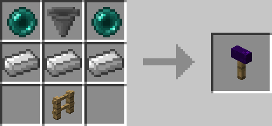

# Ender Mailbox

## Description

---

The Ender Mailbox is a personal storage system that works with [Ender Letters](../items/ender-letter). Each mailbox is bound to the player who placed it and provides a private inventory for receiving mail.

When you place an Ender Mailbox, it becomes yours. Only you can open it to retrieve your mail. The mailbox will show visual particles when it contains mail, making it easy to see when you have new items waiting. To access your mail, simply right-click your mailbox to open your personal mail inventory.

All Ender Mailboxes you place are linked together, so letters you receive will appear in every Ender Mailbox you own.

## Crafting

---

## Screenshots

---
TODO

