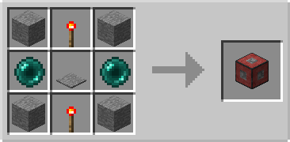
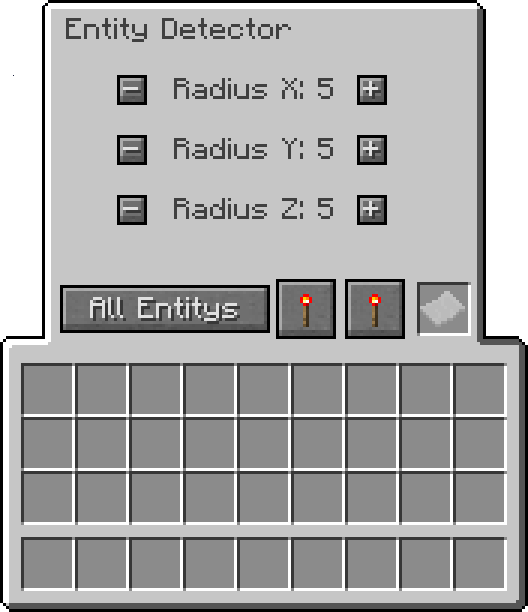

# Entity Detector

## Description

---

The Entity Detector is a block that emits a redstone signal when it detects entities of a specified type within a configurable radius. Right-click the block to open its GUI, where you can configure the detection radius, filter type, and output behavior.

## Features

---

### Detection Radius

The Entity Detector can detect entities in a configurable 3D radius. You can set separate ranges for X, Y, and Z axes. The maximum range for each axis is 10 blocks.

### Entity Filters

The detector can filter entities by type:

- **All**: Detects any entity
- **Living**: Detects only living entities
- **Animal**: Detects only animals
- **Monster**: Detects only hostile mobs
- **Player**: Detects only players
- **Items**: Detects only item entities
- **Custom**: Uses an [Entity Filter](../items/entity-filter) placed in the detector's inventory slot

### Invert Mode

When invert mode is enabled, the detector's logic is reversed. For example, if the filter is set to "Players" and invert is enabled, the detector will emit a signal when any entity that is NOT a player is detected.

### Power Modes

The Entity Detector has three power output modes:

- **Weak**: Outputs a redstone signal strength of 1 when entities are detected, 0 when not
- **Strong**: Outputs a redstone signal strength of 15 when entities are detected, 0 when not
- **Proportional**: Outputs a redstone signal strength based on the number of entities detected (1 per entity, up to 15). When invert mode is enabled, the power level decreases with entity count

## Crafting

---

## Screenshots

---

