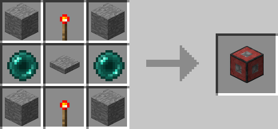

# Entity Detector

## Description

---

The Entity Detector is a block that emits a redstone signal if it detects a certain type of entity in a configurable radius around it. If you right click on the block it will open a gui in where you can change the radius & the type of entity the detector is supposed to react to. You can also invert the filter (If you invert “Players” the detector will emit a redstone signal if any entity that is NOT a player is inside of its radius). If you set the Filter to Custom the block will use the [Entity Filter](../items/entity-filter.html) in its inventory slot as its filter.

## Crafting

---

## Screenshots

---

