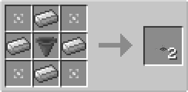

# Extraction Plate

## Description

---

The Extraction Plate is a special block that can be placed on top of solid blocks. It has no collision box, allowing entities to pass through it, but it extracts items from inventories.

The Extraction Plate extracts items from inventories and pushes them toward the output side. It extracts from the inventory below it and the inventory on the opposite side of the output. You can change the output side by shift right-clicking with an empty hand, and configure which side it extracts from in the GUI.

## Crafting

---

TODO

