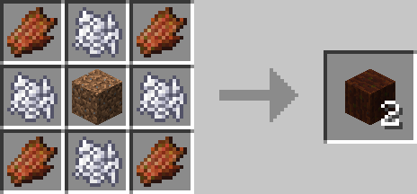

# Fertilized Dirt

## Description

---

Works pretty much the same as vanilla farmland, except it does not require any nearby water blocks, increases the growth of plants by a factor of 3 and crops are not destroyed when walking or jumping on the Fertilized Dirt like it sometimes happens with vanilla farmland.

## Crafting

---

