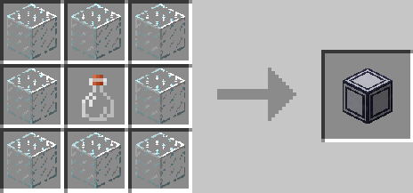

# Fluid Display

## Description

---

The Fluid Display is a decorative block that can take on the textures of fluids. Just right click one with any kind of fluid container to set the fluid displayed. Right clicking it with something else will switch it between the flowing and stationary fluid texture. Shift right clicking it with an empty hand will rotate it.

## Crafting

---

## Screenshots

---

