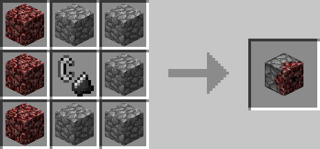

# Igniter

## Description

---

The Igniter is basically the block version of flint and steel, if powered by redstone it ignites the block in front of it. If it becomes unpowered it puts out the flame in front of it.

In its GUI you can switch between 3 modes:

1. Toggle Fire (default): Will ignite the block in front when powered and extinguish it when unpowered.
2. Ignite: Will ignite the block in front when powered
3. Keep Ignited: Will ignite the block in front and keep reigniting it on block updates.

## Crafting

---

