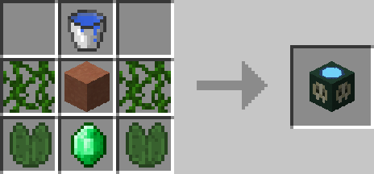

# Imbuing Station

## Description

---

The Imbuing Station is used to create Imbues that give your player on hit effects.

There are currently 4 different imbues available:

| Name             | Effect                                               |
|------------------|-----------------------------------------------------|
| Fire Imbue       | Sets hit enemies on fire for 10 seconds             |
| Poison Imbue     | Applies Poison II to hit enemies for 10 seconds     |
| Experience Imbue | Enemies killed while active drop 50% more experience|
| Wither Imbue     | Applies Wither II to hit enemies for 5 seconds      |

You can only have one imbue active at a time. Drinking another one while one is still active will cancel the first one. All imbues last 20 minutes.

## Armor upgrading

---

The Imbuing Station can also be used to upgrade Diamond Armor pieces to Spectre Armor pieces. Each recipe requires 3 Spectre Ingots and 1 Diamond Armor piece to create the corresponding Spectre Armor piece:

| Input | Output |
|-------|--------|
| 3 Spectre Ingots + Diamond Helmet | Spectre Helmet |
| 3 Spectre Ingots + Diamond Chestplate | Spectre Chestplate |
| 3 Spectre Ingots + Diamond Leggings | Spectre Leggings |
| 3 Spectre Ingots + Diamond Boots | Spectre Boots |

**Note:** NBT data (including enchantments, durability, and other item data) is transferred from the Diamond Armor piece to the resulting Spectre Armor piece.

## Other Recipes

---

The Imbuing Station can also be used for other crafting recipes:

| Input | Output |
|-------|--------|
| Water Bottle + Vine + Bone Meal + Cobblestone | Mossy Cobblestone |

## Crafting

---

