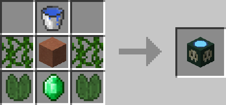

# Imbuing Station

## Description

---

The Imbuing Station is used to create Imbues that give your player on hit effects.

There are currently 4 different imbues available:

NameEffectFire ImbueSets hit enemies on fire for 10 secondsPoison ImbueApplies Poison II to hit enemies lasting 10 secondsExperience ImbueEnemies killed while active drop 50% more experienceWither ImbueApplies Wither II to hit enemies lasting 5 secondsYou can only have one imbue active at a time. Drinking another one while one is still active will cancel the first one. All imbues last 20 minutes.

## Crafting

---

