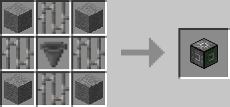
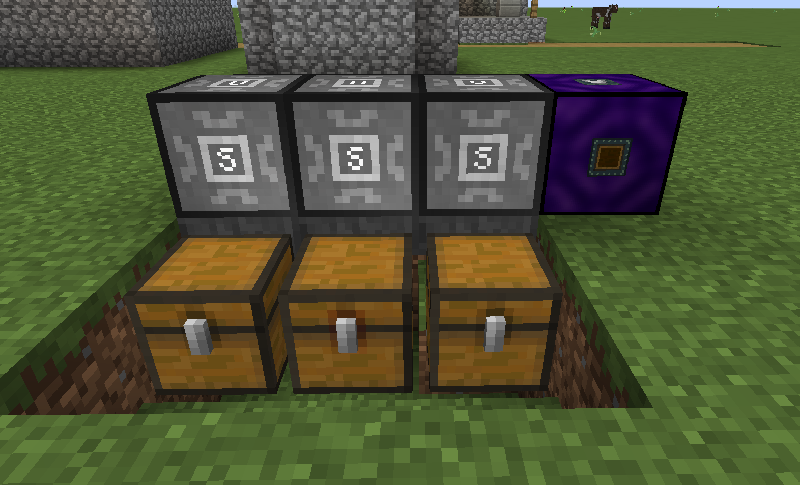

# Inventory Rerouter

## Description

---

Each side of the Inventory Rerouter corresponds to a side of the block in front of it. You can reassign these connections by right-clicking them. When items are inserted into or extracted from the Inventory Rerouter, they will instead be inserted into or extracted from the configured side of the inventory in front of it.

## Crafting

---

## Screenshots

---

