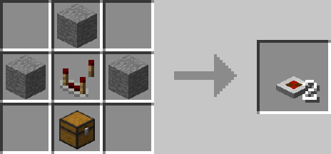
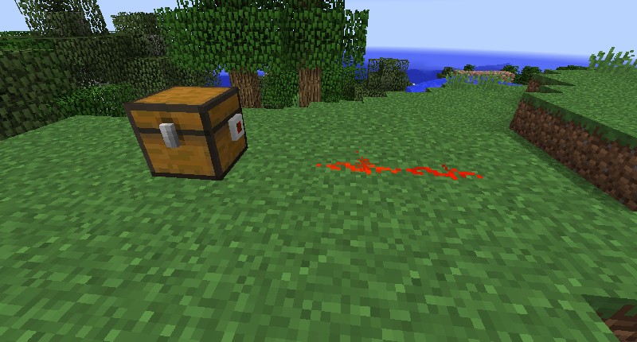

# Inventory Tester

## Description

---

The Inventory Tester has to be placed against an inventory and will continuously simulate inserting the ItemStack you specifiy in its gui into the inventory it’s attached to. While successful it will emit a redstone signal (You can invert the redstone output with the button in the gui). Since it’s only simulated no items will actually be inserted.

## Crafting

---

## Screenshots

---

