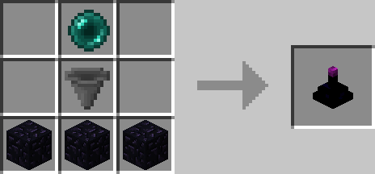
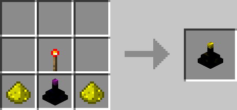

# Item Collector

## Description

---

The Item Collector is basically a hopper with a range. You can place it on any Inventory you want and it will start collecting items in a 3 block radius around the item collector.
Simply (shift) place the item collector on the inventory the collected items are supposed to go into.

The Advanced Item Collector is the upgraded version of the Item Collector, its range can be configured to be between 0 and 10 for each direction and you can also insert an [Item Filter](../items/item-filter.html) to specify which items are / are not supposed to be picked up.
For the Advanced Item Collector right click on it to bring up the GUI to configure its range and insert an [Item Filter](../items/item-filter.html).

## Crafting

---

