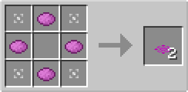

# Item Rejuvenator Plate

## Description

---

The Item Rejuvenator Plate is a special block that can be placed on top of solid blocks. It has no collision box, allowing entities to pass through it, but it affects item entities that move over it.

The Item Rejuvenator Plate resets the despawn timer of item entities to four minutes when they move over it. This prevents items from disappearing and gives you more time to transport or collect them.

## Crafting

---

TODO

