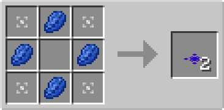

# Item Sealer Plate

## Description

---

The Item Sealer Plate is a flat plate that can be placed on top of solid blocks. It has no collision box, allowing entities to pass through it, but it affects item entities that move over it.

The Item Sealer Plate prevents item entities from being picked up for 30 seconds after they move over it, preventing them from being accidentally collected by players or other entities. They can still be picked up by blocks, like hoppers, [Item Collectors](../blocks/item-collector) and [Collection Plates](collection-plate).

## Crafting

---

