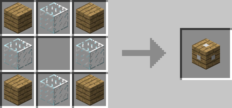

# Light Redirector

## Description

---

The Light Redirector switches the model of a block placed next to it with the model of the block that is on the opposite side of it. Right clicking one of the sides will disable it. Blocks on disabled sides won’t change appereance. You can for example use it to make blocks like lamps look like normal blocks.

## Crafting

---

## Videos

---

<video controls>
  <source src="https://lumien.net/rtwiki/images/screenshots/light-redirector-1.mp4" type="video/mp4">
</video>

<video controls>
  <source src="https://lumien.net/rtwiki/images/screenshots/light-redirector-2.mp4" type="video/mp4">
</video>