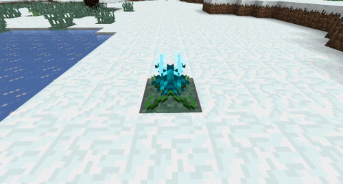

# Lotus

## Description

---

You can find Lotus plants in biomes with the “Snowy” tag. When fully grown you can right click them to get a Lotus Blossom which you can eat to get some experience. When broken, Lotus plants will drop 1 lotus seed so you can plant them somewhere else.

## Screenshots

---

Fully grown lotus
