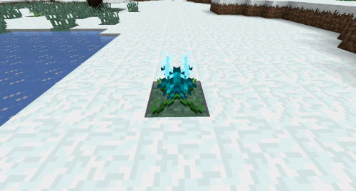

# Lotus

## Description

---

You can find Lotus plants in biomes snowy biomes. When fully grown you can right click them to get a Lotus Blossom, which you can eat to get some experience. When broken, Lotus plants will drop 1 Lotus Seeds so you can plant them somewhere else.

## Screenshots

---

Fully grown Lotus
