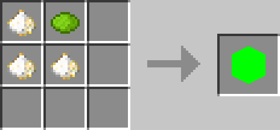
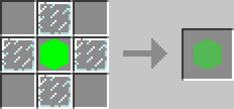
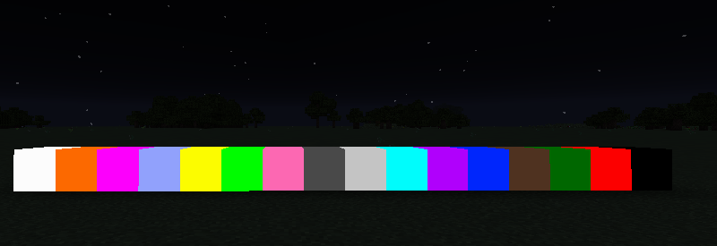
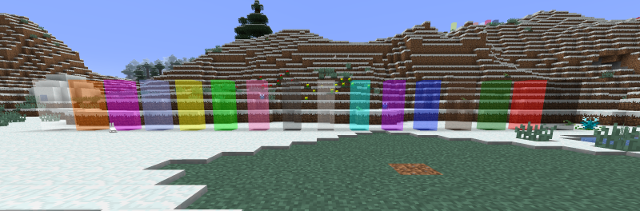

<!-- TODO: Verify all color variants and crafting recipes -->
---
title: Luminous Blocks
category: blocks
---

# Luminous Blocks

## Description

---

Luminous Blocks are bright, colorful blocks that glow in the dark. They come in all 16 dye colors, so you can pick the perfect shade for your build. They're solid blocks that give off light, making them great for both decoration and illumination.

Translucent Luminous Blocks work the same way but are see-through. You get all the same colors and the same glow, but you can see through them like stained glass. Perfect for creating stained glass windows that light themselves up, or any build where you want both transparency and built-in lighting.

## Crafting

---

## Screenshots

---

