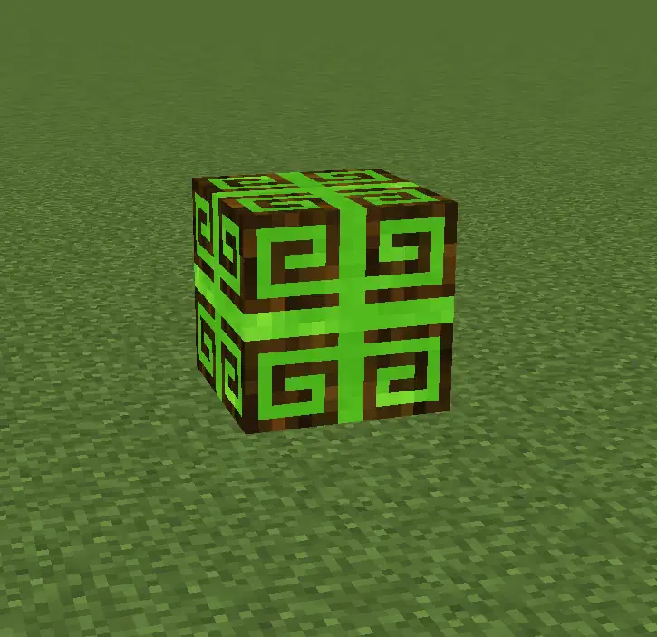
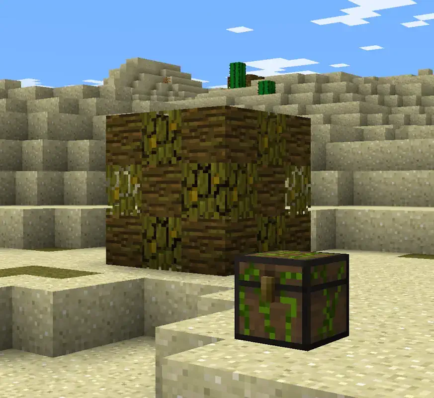

# Nature Core

## Description

---

The Nature Core is a rare block that generates naturally in the world, with a higher change of occuring in lifeless biomes. The Core itself is surrounded by a shell of jungle logs and leaves in a decorative pattern. The core requires a diamond axe to harvest. While active, it performs several natural processes in its vicinity, like spawning animals, replacing sand with grass, bonemealing surrounding plants and grass, spawning trees and regenerating its shell. Its spawning chance, as well as the behavior of these processes, are configurable.

The Nature Core also spawns an accompanying Nature Chest, containing a variety of natural items, like beans, saplings, vines, flowers, seeds and crops.

## Screenshots

---

