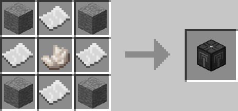
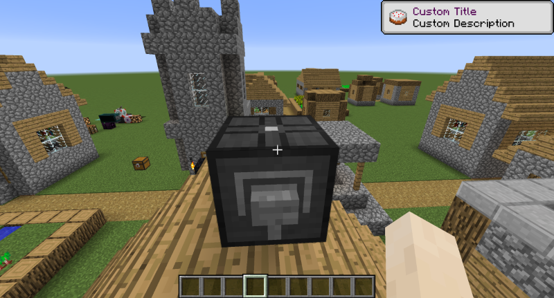

# Notification Interface

## Description

---

The Notification Interface allows you to send yourself toast notifications with customizable title,description & icon. It’s activated by a redstone signal.

When Open Computers is installed it also provides a component called “notification_interface” with the following functions:

- notify(title, description, iconName, iconMeta)Example: notify(“Custom Title”, “Custom Description”, “minecraft:cake”, 0)

## Crafting

---

## Screenshots

---

