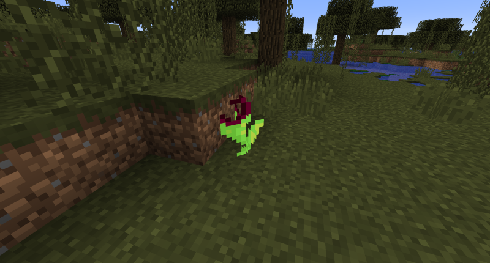

# Pitcher Plant

## Description

---

Right clicking a Pitcher Plant with a fluid container will fill the fluid container with water. It also slowly fills cauldrons or other fluid tanks next to it with water.

## Screenshots

---

