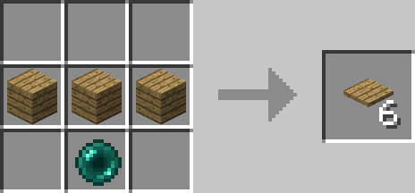
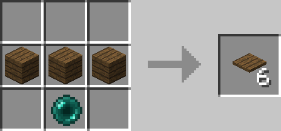
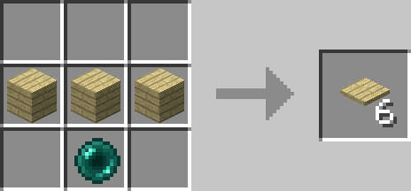
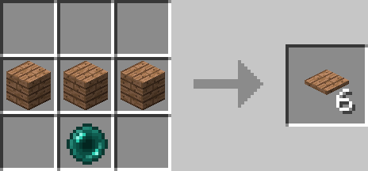
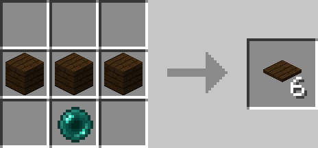

<!-- TODO: Verify all platform variants and their properties -->
---
title: Platforms
category: blocks
---

# Platforms

## Description

---

Platforms are clever blocks that are only solid on top - you can walk on them, but walk right through them from the sides or bottom. If you need to drop through one, just hold shift and you'll fall right through even from the top. Perfect for creating multi-level builds where you want easy access between floors.

There are also Super Lubricent versions of platforms that make everything slide super fast. The Super Lubricent Platform is a thin, see-through platform that's incredibly slippery - great for fast transportation systems. You can sneak on it to stop sliding if you need to. The Filtered Super Lubricent Platform works the same way, but you can configure it with item filters so only certain items can pass through while others slide normally.

Super Lubricent Ice and Super Lubricent Stone are full blocks (not platforms) that provide the same extreme slipperiness. Super Lubricent Ice looks like ice but is way more slippery, while Super Lubricent Stone gives you that slippery speed with a stone appearance. Both are perfect for creating fast item transport routes or player movement systems.

## Crafting

---

