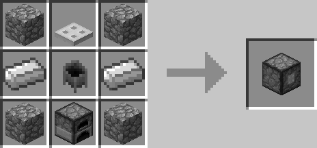
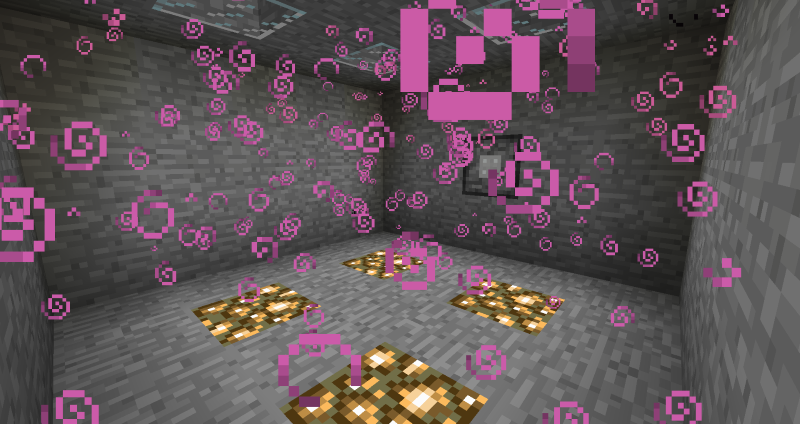

# Potion Vaporizer

## Description

---

The Potion Vaporizer is a block that fills rooms with potion vapor, applying potion effects to any entity that comes in contact with it. For the Potion Vaporizer to work it requires potions (Left Slot) and any form of furnace fuel (bottom slot). It outputs empty glass bottles to the right slot as it consumes potions. The front of the block has to point towards a closed off room, that room can have a volume of up to 100 blocks. If it’s larger than that or it’s not completely sealed the Potion Vaporizer won’t work. If it works you will see particles appearing in the affected area. A single potion lasts as long as the potion would last if you drank it. It consumes fuel at the same rate a furnace does. However if it runs out of fuel midway the rest of the potion will not be lost, it will simply wait until it has fuel again.

## Crafting

---

## Screenshots

---

