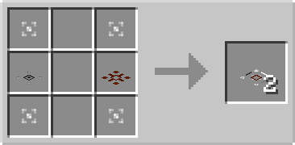

# Processing Plate

## Description

---

The Processing Plate is a special block that can be placed on top of solid blocks. It has no collision box, allowing entities to pass through it, but it processes items that move over it.

The Processing Plate combines the functionality of an Extraction Plate and a Collection Plate. It attempts to insert items going over it into the inventory below it, and also extracts items and pushes them toward the output side. You can change the output side by shift right-clicking it with an empty hand. The sides it extracts from and inserts into can be changed in the GUI.

## Crafting

---

TODO

