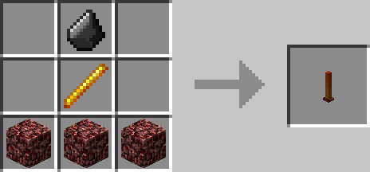

# Rain Shield

## Description

---

The Rain Shield shields block in its range (80 blocks by default, configurable) from rain. In its radius there will be no rain particles / sounds & stuff like fire that would normally react to rain will act as if it wasn't raining.
By applying a redstone signal to it you can disable its effect. There will also be no snow forming on top of blocks in snowy biomes.

## Crafting

---

## Videos

---

<video controls>
  <source src="../videos/rain-shield.mp4" type="video/mp4">
</video>