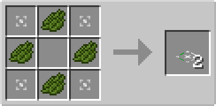
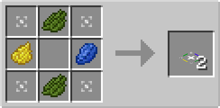

# Redirector Plate

## Description

---

Redirector Plates are special blocks that can be placed on top of solid blocks. They have no collision box, allowing entities to pass through, but affect entities that move over them by redirecting their movement toward a chosen direction. The direction can be changed by right-clicking the plate.

Filtered Redirector Plates extend this functionality by redirecting entities based on filters—allowing different types of entities or items to be routed in different directions. They accept [Entity Filters](../items/entity-filter) to filter entities based on their type.

Both plates operate similarly to the [Redstone Plate](redstone-plate), but without the redstone power feature.

## Crafting

---

TODO

