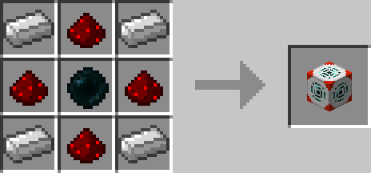
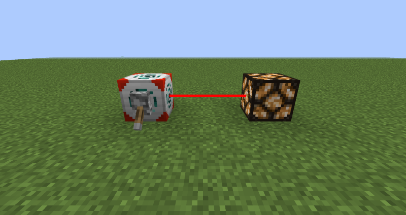
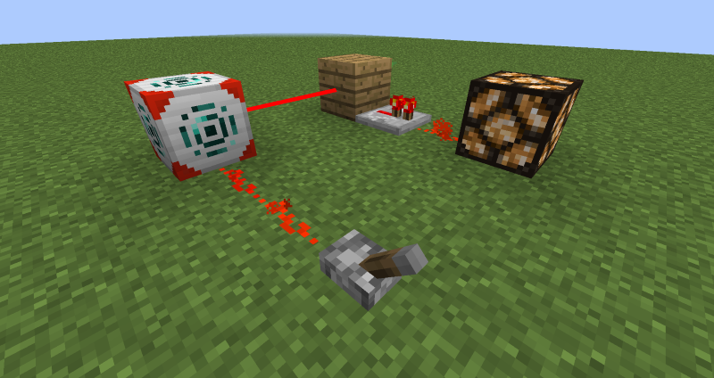

# Redstone Interface

## Description

---

The Redstone Interface allows you to redstone-power blocks wirelessly. Unlike other wireless redstone mechanics it directly powers the target, therefore not requiring any kind of receiver. Generally the redstone interface will act as the block that it’s linked to (redstone wise). It does not have a range limitation but it does not work across dimensions.

To specify the target of a redstone interface you have to use a [Redstone Tool](../items/redstone-tool). First right click on the redstone interface and then on the block you want to link it to. While holding a redstone tool you are able to see these connections as red lines as long as you are close to the redstone interface they are connected to.

If you have Open Computers installed this block also provides a component called “basic_redstone_interface” that provides the following functions:

- setTarget(x,y,z) : Sets the target of the Redstone Interface
- getTarget() : Returns the target of the Redstone Interface (nil if it doesn’t have one)

## Advanced Redstone Interface

---

There is also the Advanced Redstone Interface, which can be linked to up to 9 blocks at the same time. Instead of the Redstone Tool, you use Position Filters which you insert into the gui of the block.

## Crafting

---

## Screenshots

---

