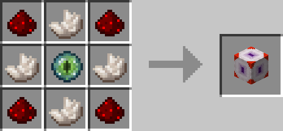

# Redstone Observer

## Description

---

The Redstone Observer emits redstone based on whether the block it's linked to emits redstone. To specify the target of a redstone observer you have to use a [Redstone Tool](redstone-interface.html). First right click on the redstone observer and then on the block you want to link it to. While holding a redstone tool you are able to see these connections as red lines as long as you are close to the block the observer is linked to.

## Crafting

---

## Screenshots

---

