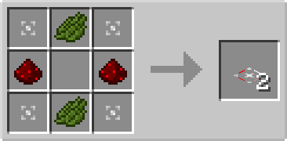

# Redstone Plate

## Description

---

The Redstone Plate is a flat plate that can be placed on top of solid blocks. It has no collision box, allowing entities to pass through it, but it affects entities that move over it.

The Redstone Plate redirects entities moving over it toward a different direction. Right-clicking the plate allows you to change the output direction. When powered by redstone, entities will continue straight instead of being redirected.

The Redstone Plate works similarly to the [Redirector Plate](redirector-plate), but with the added ability to be disabled by redstone power.

## Crafting

---

