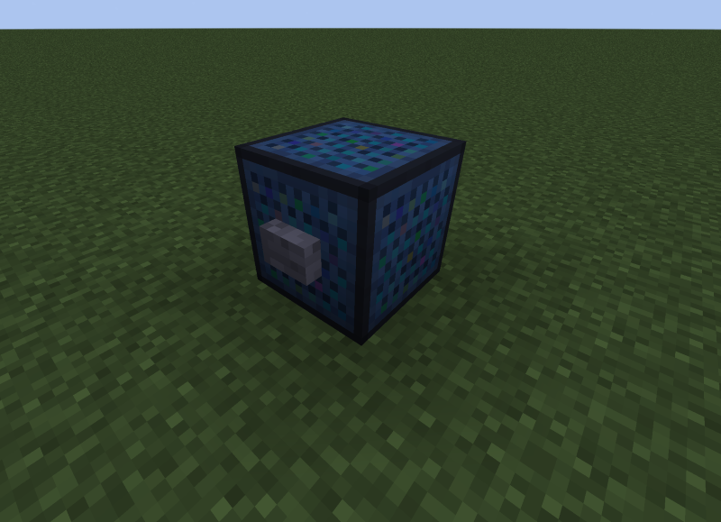

# Sound Box

## Description

---

A Sound Box will play the sound represented by the [Sound Pattern](../items/sound-pattern.html) inside of it when powered by redstone. Simply right click a sound pattern on the box to put it inside and right click it again to take it out again.

## Crafting

---

## Screenshots

---

