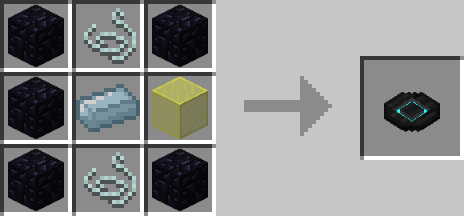
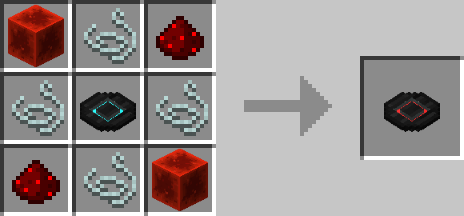
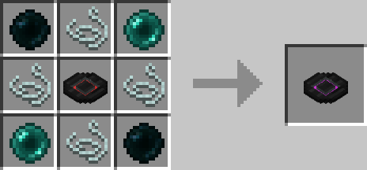
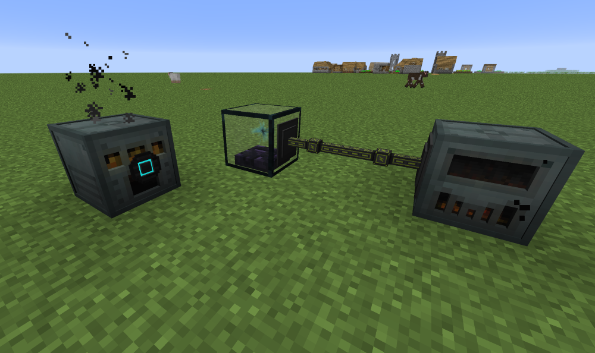

# Spectre Coils

## Description

---

Spectre Coils are a way to wirelessly transmit energy across your world. Each player has their own spectre energy buffer which they can fill with energy using a Spectre Energy Injector. Spectre Coils access that buffer and will transmit energy from that buffer into the block they are attached to. The amount of energy they transmit per tick depends on the tier.

- Normal: 1024 per Tick
- Redstone: 4096 per Tick
- Ender: 20480 per Tick

There are also two special coils: Numbered and Genesis. Numbered Coils can be found in dungeon chests and generate 128 energy per Tick on their own. Genesis Coils do not have a crafting recipe and cannot be found, and generate Infinite Energy, but can be configured to transfer Infinite energy instead of generating it, acting as a higher tier regular coil.

Spectre Energy Injector capacity, Numbered Coil generated energy per tick, as well as regular Coils transfer rate multiplier can also be changed in the config.

## Crafting

---

## Screenshots

---

