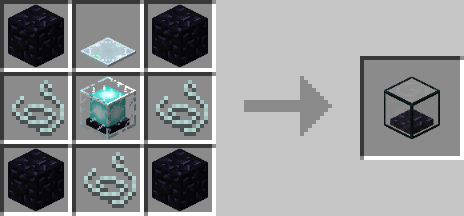
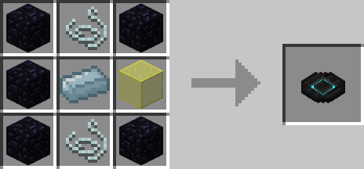
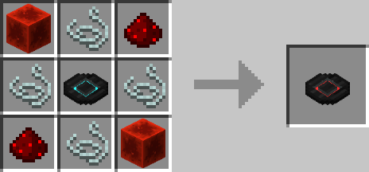
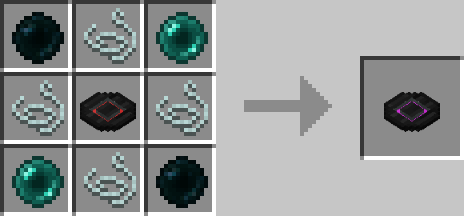

# Spectre Coils

## Description

---

Spectre Coils are a way to wirelessly transmit energy across your world. Each player has their own spectre energy buffer which they can fill with energy using a Spectre Energy Injector. Spectre Coils access that buffer and will transmit energy from that buffer into the block they are attached to.
The amount of energy they transmit per tick depends on the tier:

Normal: 1024 per Tick
Redstone: 4096 per Tick
Ender: 20480 per Tick

Both the Coils and the Injector always access the buffer of the player that placed them. Since they are bound to your player they don’t have a range limitation and also work across dimensions.

In addition there are also Numbered & Genesis Coils. Numbered Coils can be found in dungeon chests and generate 128 Energy per Tick on their own. Genesis Coils are creative mode only and generate 10000000 Energy per Tick.

## Crafting

---

## Screenshots

---

