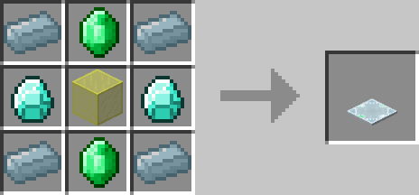

# Spectre Lens

## Description

---

Putting a Spectre Lens on top of a beacon will apply the effects of that beacon to your player no matter where you are in the dimension of the beacon.
You can only use 1 Spectre Lens per dimension at once, having multiple ones will make them overwrite each other.

## Crafting

---

## Screenshots

---

