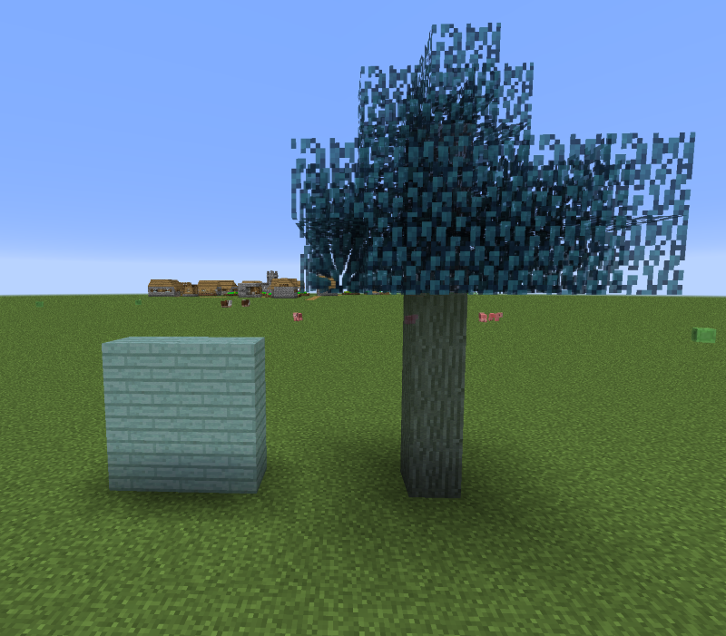

# Spectre Sapling

## Description

---

Created by right clicking a vanilla sapling with Ectoplasm this sapling grows into a spectre tree whose leaves might drop some Ectoplasm when broken. While you should come out with a surplus of Ectoplasm chance wise you might need a bunch of these to really get started farming Ectoplasm.

The Spectre Sapling can be enabled or disabled in the config menu. If disabled, the sapling will not grow and cannot be created from regular saplings.

Spectre Saplings can be grown using Thermal Expansion's Insolator, providing an automated way to farm Ectoplasm, though you will lose the sapling in the process.

## Screenshots

---

## Videos

---

<video controls>
  <source src="../videos/spectre-sapling-1.mp4" type="video/mp4">
</video>